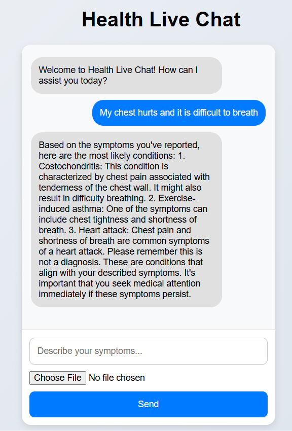

# Health Live Chat

**Health Live Chat** is an AI-powered conversational assistant that helps users ask general health-related questions and receive instant, informative answers. It uses large language models (LLMs) to provide context-aware, privacy-conscious, and user-friendly health information responses.  
[HealthLiveChat](https://healthlivechat.onrender.com/)  
[5 Minute Presentation](https://www.youtube.com/watch?v=9jJX6KOgGoU)  

## Full Documentation

- [Technical Docs and User Manual](./technical_docs_and_user_manual.md)  
- [Deployment Guide](./deployment_guide.md)  
- [Security and Responsible AI Practices](./security_and_ethics.md)  
- [API Reference](./api_docs.md)  

## Project Goals
- Build and deploy a conversational health assistant
- Implement secure, ethical, and scalable LLM workflows
- Demonstrate week-by-week updates in line with production-ready AI standards
- Create a portfolio-ready project using AWS or open-source tools

## Weekly Breakdown

### Week 1: Foundational Conversational AI (OpenAI)
- Implemented initial version of the Health Live Chat assistant
- Used OpenAI GPT model to power health-related conversations
- Built core message loop and response logic
- Documented basic usage and architecture

### Week 2: Modular Pipeline and Bedrock Integration
- Refactored chatbot into a modular pipeline (`pipeline.py`)
  - Input → moderation → model → logging → output
- Implemented retry logic and logging to `chatlog.csv`
- Structured code to easily be switched to bedrock once I recieve access

### Week 3: Enterprise Deployment and Security
- Deployed the backend using AWS App Runner: Waiting for permission from TA 
  - Used Render for now
- Added token-based authentication to secure endpoints
- Implemented basic audit logging for user activity

### Week 4: Usage Analytics and Dashboard
- Tracked key metrics:
  - Number of queries
  - Common keywords
  - Average response length
- Visualized logs with a basic dashboard (Streamlit + CSV analysis)
- Saved log data to S3 bucket and pulled into Streamlit for performance tracking

### Week 5: Safety Filters and Generative AI Ethics
- Implemented basic content moderation for unsafe inputs
- Striped PII before sending queries to the model
- Added disclaimers and tuned prompts to reduce hallucination
- Strengthened user safety and aligned with Responsible AI practices

### Week 6: Caching and Multimodal Integration
- Implemented Caching
- Added image/text multi-modal pipeline
- Created api wrapper

### Final Polish
- Tied everything into bedrock and apprunner and S3 bucket
- System Diagram
- Finalize documentation and how to use guide:
  - `README.md`
  - `api_docs.md`
  - `security_and_ethics.md`
  - `deployment_guide.md`
- Record a 5-minute demo video walkthrough of the project
- Clean and organize code for final submission

## Author
Jesse Warren  
Duke University  
AIPI561 - Operationalizing AI